# 🎮 Video Game Sales & Engagement Analysis

An **end-to-end Data Analytics project** analyzing video game ratings, engagement metrics, and global sales using **Python, SQL, and Streamlit**.

This project demonstrates the complete **data analytics workflow**:

- Data Cleaning & Preprocessing  
- SQL Database Design  
- Exploratory Data Analysis (EDA)  
- Data Visualization  
- Interactive Dashboard Development  

---

# 📊 Project Overview

The video game industry generates billions of dollars every year.  
This project analyzes **video game ratings, engagement metrics, and global sales data** to uncover patterns such as:

- Which **genres generate the most sales**
- Which **platforms dominate the gaming market**
- The relationship between **ratings and sales**
- Player engagement metrics such as **plays, wishlist, and reviews**
- **Regional sales distribution**

---

# 📂 Dataset Information

This project uses two raw datasets related to video game sales and engagement metrics.

---

## 1️⃣ Video Game Engagement Dataset

This dataset contains engagement information for popular video games.

**Columns include:**

- Column1
- Title  
- Release Date
- Team
- Rating
- Times Listed
- Number of Reviews
- Genres
- Summary
- Reviews
- Plays  
- Playing  
- Backlogs  
- Wishlist

This dataset is used to analyze **player engagement and rating patterns**.

Raw dataset file: [games.csv](https://drive.google.com/file/d/1xTtPz0zTVpcoYe0c4Cq6xy8K-1qJj0K8/view?usp=sharing)

## 2️⃣ Video Game Sales Dataset

This dataset contains global sales data for video games across different platforms.

**Columns include:**

- Rank
- Name
- Platform
- Year
- Genre
- Publisher
- NA Sales
- EU Sales
- JP Sales
- Other Sales
- Global Sales

This dataset is used to analyze platform performance, publisher sales, and global market trends.

Raw dataset file:  [vgsales.csv](https://drive.google.com/file/d/12b6CrDddupzYpcDkkJUlNRG04ehnEENU/view?usp=sharing)

--- 

# 📂 Project Structure
```
video-game-sales-engagement-analysis
│
├── notebook
│ └── data_cleaning.ipynb
│
├── cleaned_data
│ ├── games_cleaned.csv
│ ├── vgsales_cleaned.csv
│ └── matched_games.csv
│
├── sql_setup
│ ├── postgresql_schema_v2.sql
│ └── sql_setup_final.ipynb
│
├── eda_analysis
│ ├── eda_notebook.ipynb
│ └── eda_analysis.sql
│
├── streamlit_app
│ └── app.py
│
├── images
│ ├── dashboard_preview.png
│ ├── eda_correlation.png
│ ├── eda_engagement.png
│ ├── eda_genre.png
│ ├── eda_genre_sales.png
│ ├── eda_platform.png
│ ├── eda_publisher.png
│ ├── eda_rating.png
│ ├── eda_rating_sales.png
│ ├── eda_regional.png
│ ├── eda_sales_dist.png
│ ├── eda_top_games.png
│ └── eda_yearly.png
│
├── presentation
│ └── video_game_analytics_project.pptx
│
├── requirements.txt
└── README.md
```
---

# 🧹 Data Cleaning

Data cleaning was performed using **Pandas in Jupyter Notebook**.

Main steps included:

- Handling missing values  
- Standardizing column names  
- Removing duplicates  
- Fixing data types  
- Creating derived features  
- Preparing dataset for SQL database  

Notebook:
```
notebook/data_cleaning.ipynb
```

Cleaned datasets are available in:
```
cleaned_data/
```
Files:

- games_cleaned.csv  
- vgsales_cleaned.csv  
- matched_games.csv  

---

# 🗄 SQL Database Setup

A **PostgreSQL database schema** was created to store cleaned datasets.

Tasks included:

- Table creation  
- Data insertion  
- Index creation  
- Query optimization  

Files:
```
sql_setup/postgresql_schema_v2.sql
sql_setup/sql_setup_final.ipynb
```
---

# 📊 Exploratory Data Analysis (EDA)

EDA was performed using **Python, Pandas, Matplotlib, and Seaborn**.

Analysis included:

- Engagement metrics distribution  
- Genre popularity  
- Platform performance  
- Publisher analysis  
- Global sales distribution  
- Regional sales trends  

Notebook: 
```
eda_analysis/eda_notebook.ipynb
```

SQL queries:
```
eda_analysis/eda_analysis.sql
```

---

# 📈 Key Visualizations

## Engagement Metrics Correlation

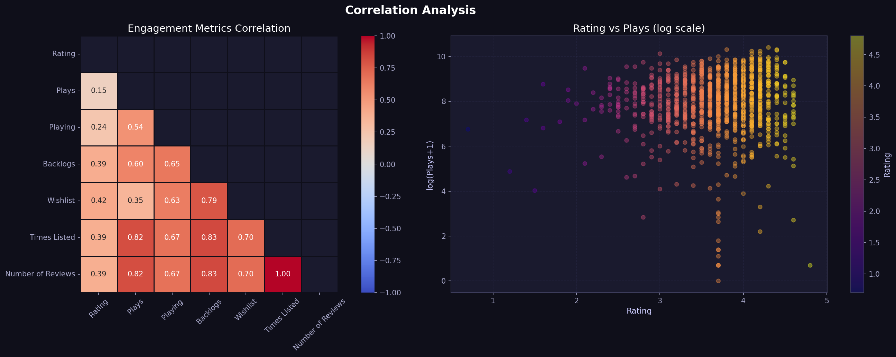

Shows correlation between engagement metrics such as:

- Plays
- Wishlist
- Reviews
- Backlogs

---

# 🎮 Engagement Metrics Distribution

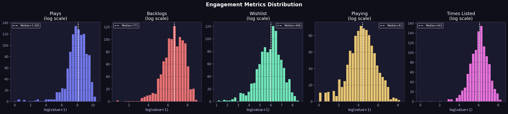

Most engagement metrics show **right-skewed distributions**, meaning a few games receive extremely high engagement.

---

# 🎮 Genre Analysis

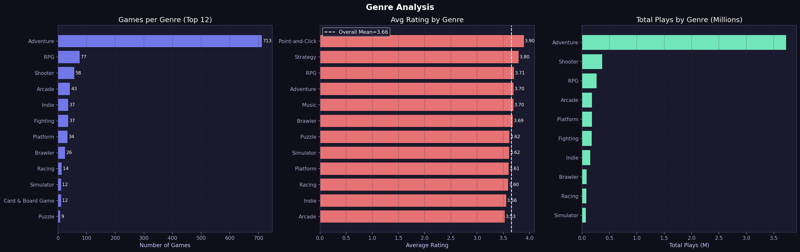

Insights:

- Adventure genre contains the highest number of games.
- RPG and Shooter are also popular genres.

---

# 💰 Genre Sales Analysis

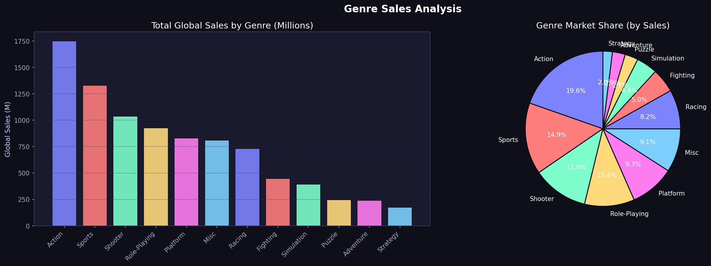

Action and Sports games generate the **highest global sales**.

---

# 🕹 Platform Analysis

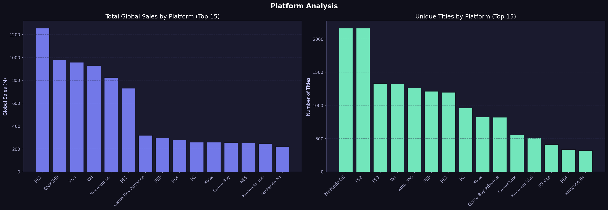

Key findings:

- **PS2 is the best-selling platform**
- Xbox 360 and PS3 also show strong performance.

---

# 🏢 Publisher Analysis

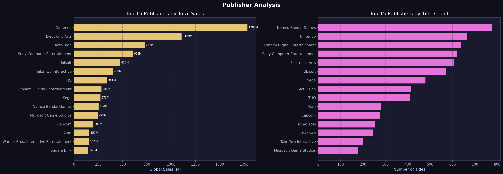

Top publishers include:

- Nintendo
- Electronic Arts
- Activision

---

# ⭐ Game Rating Analysis

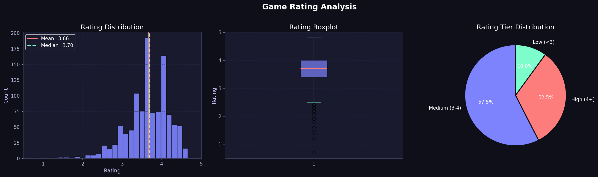

Average rating across games is approximately **3.66 / 5**.

---

# ⭐ Rating vs Sales Analysis

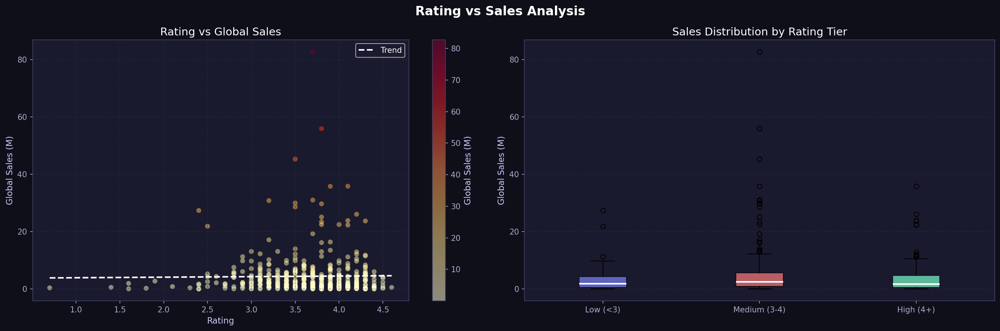

The correlation between rating and global sales is **very weak**, meaning highly rated games do not always generate the highest sales.

---

# 🌍 Regional Sales Analysis

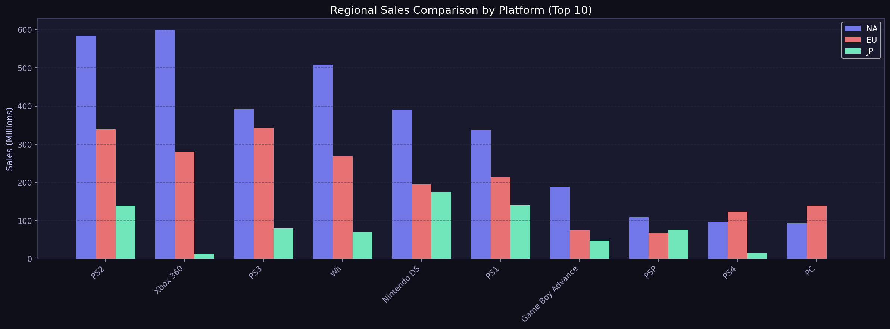

North America dominates global sales followed by Europe and Japan.

---

# 💰 Global Sales Distribution

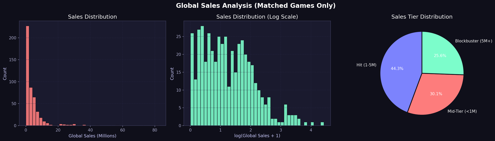

Most games sell fewer than **1 million copies**, while a small number become blockbuster hits.

---

# 🏆 Top Games Dashboard

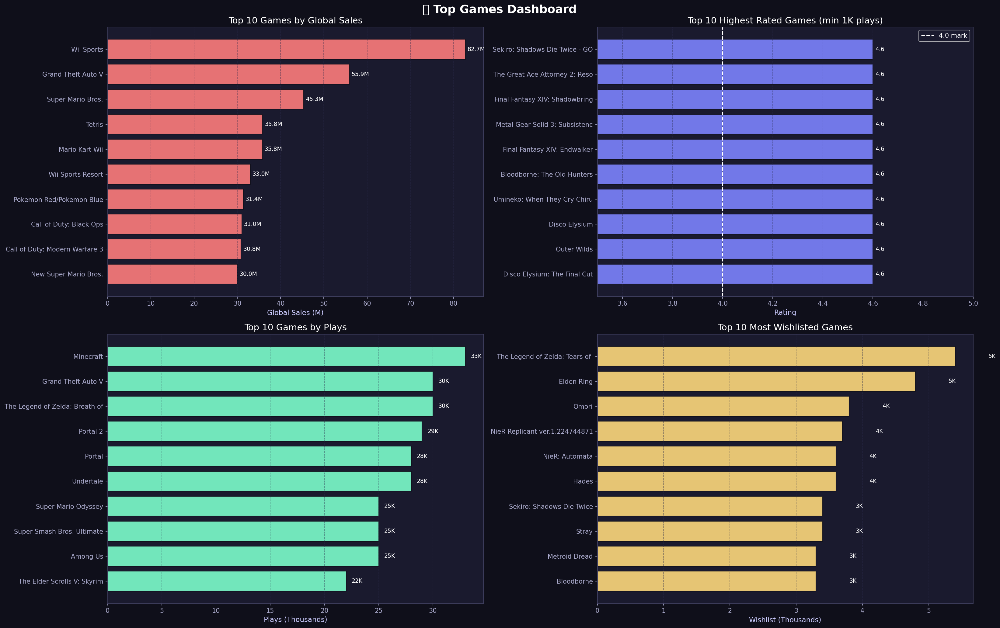

Highlights:

- Top games by global sales
- Highest rated games
- Most played games
- Most wishlisted games

---

# 📈 Industry Trends (1990–2016)

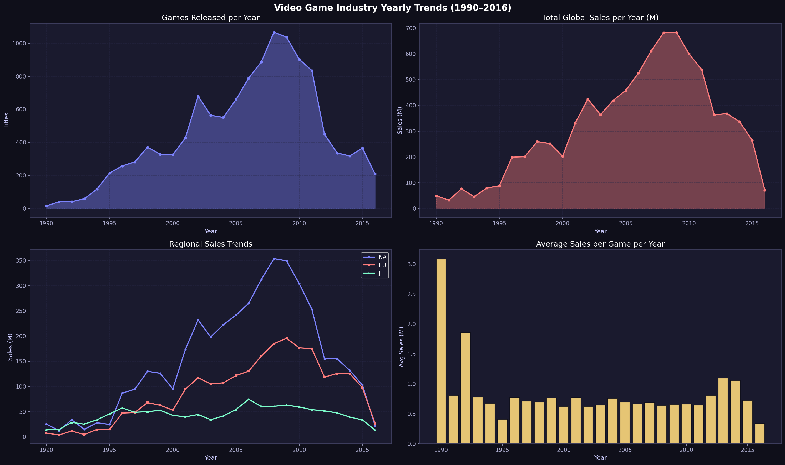

Key insights:

- Peak release year → **2008**
- Peak sales year → **2009**

---

# 📊 Streamlit Dashboard

An interactive **Streamlit dashboard** was developed to explore the dataset visually.

Run locally:
```
streamlit run streamlit_app/app.py
```

Dashboard preview:

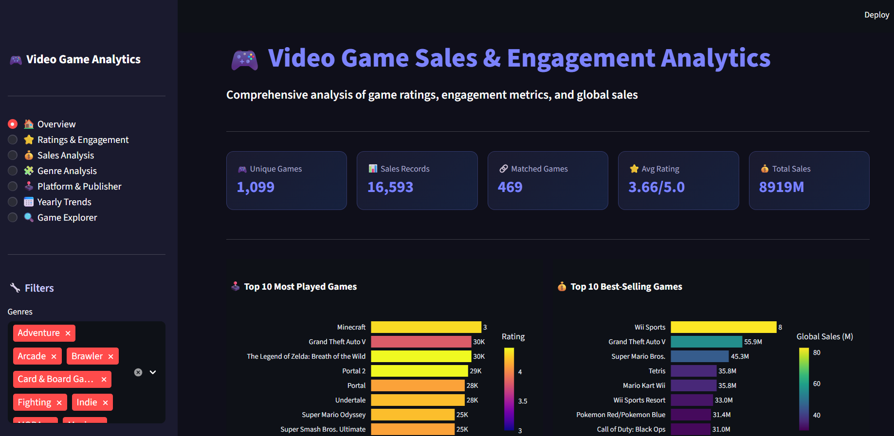

---

# 🚀 How to Run the Project

Clone the repository:

git clone https://github.com/Rudra-Barman/video-game-sales-engagement-analysis.git

---

Install dependencies:
```
pip install -r requirements.txt
```
---

Run the Streamlit app:
```
streamlit run app.py
```
---

# 📑 Project Presentation

The full project explanation is available here:
```
presentation/video_game_analytics_project.pptx
```
---

# 👨‍💻 Author

**Rudra Barman**

Aspiring Data Analyst interested in:

- Data Analytics
- Data Visualization
- SQL
- Python
- Dashboard Development

---

⭐ If you like this project, consider giving it a **star on GitHub**.

---


